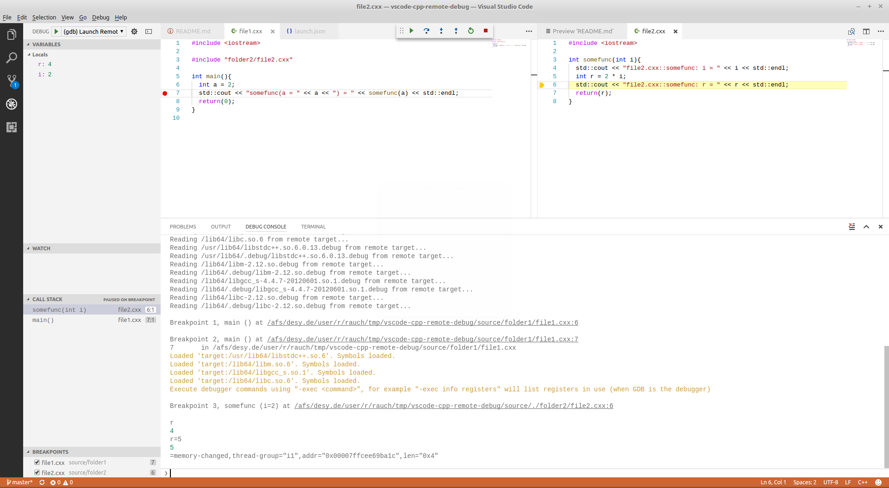

# vscode-cpp-remote-debug
Project for testing remote debugging of C++ code with gdb and gdbserver in VS Code

## Prerequisites

- a remote host reachable via `ssh`
  - `gdbserver` should be installed on the remote host
  - no root privileges are required on the remote host, plain user rights are enough
- VisualStudio Code installed on the local machine
  - the [C/C++ extension](https://marketplace.visualstudio.com/items?itemName=ms-vscode.cpptools) should be installed


## Setup

- my local machine is Linux notebook (Linux Mint 18 Cinnamon Edition), denoted by `local $`

  - the file system of the remote machine has to be mounted on the local machine either using `File -> Connect to Server` (type: `ssh`) from the Nemo file browser or using `sshfs`
  
- my remote machine is Linux server, denoted by `remote $`, on which `gdbserver` is available


## Step-by-Step Instructions to Reproduce

- SSH to remote machine and use port forwarding
  ```sh
  local $ ssh -L9091:localhost:9091 user@some.server.org
  ```
- Clone repo with
  ```sh
  remote $ git clone https://github.com/dmrauch/vscode-cpp-remote-debug.git
  ```
- Out-of-source build with debug symbols
  ```sh
  remote $ cd vscode-cpp-remote-debug/build/debug
  remote $ cmake -DCMAKE_BUILD_TYPE=Debug ../../source
  remote $ make
  ```
- Start `gdbserver`
  ```sh
  remote $ cd ../.. # going back into vscode-cpp-remote-debug/
  remote $ gdbserver :9091 build/debug/file1
  ```
- Mount the remote file system in the file browser as mentioned above, i.e. *either* in the Nemo file browser do `File -> Connect to Server` *or* use `sshfs`
- Open VisualStudio Code and open the project / repository folder from the mounted location
- Open and possibly edit the code, set breakpoints somewhere in one or both source code files `folder1/file1.cxx` and `folder2/file2.cxx`
- Adapt the `.vscode/launch.json` file to your needs
  - In particular you will have to change the `sourceFileMap` parameter which needs to contain all information about the mounted remote file system. By hovering the mouse over one of the open code tabs (e.g. `file1.cxx`) you can read off what should go there in your case.

- Open the debug view, select the `Remote Debug` configuration and launch the debugger configuration `(gdb) Launch Remote Debugging of file1`

Happy debugging!




## Credits

- The `launch.json` is based on the following, very helpful article: [Debugging C/C++ Programs Remotely Using Visual Studio Code and gdbserver](https://medium.com/@spe_/debugging-c-c-programs-remotely-using-visual-studio-code-and-gdbserver-559d3434fb78).
- Big thanks go to [@pieandcakes](https://github.com/pieandcakes) for pointing out the `sourceFileMap` property in `.vscode/launch.json` ([GitHub#834](https://github.com/Microsoft/vscode-cpptools/issues/834#issuecomment-309519732)).