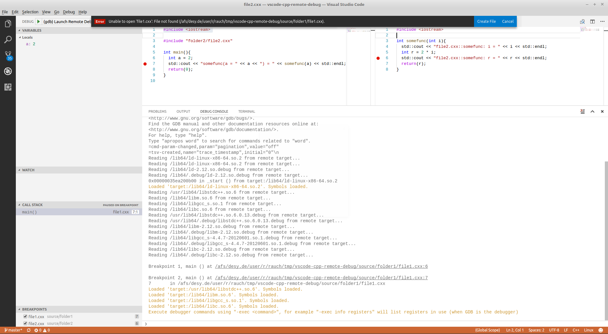
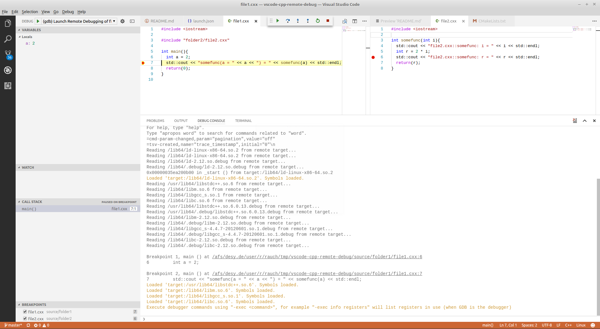
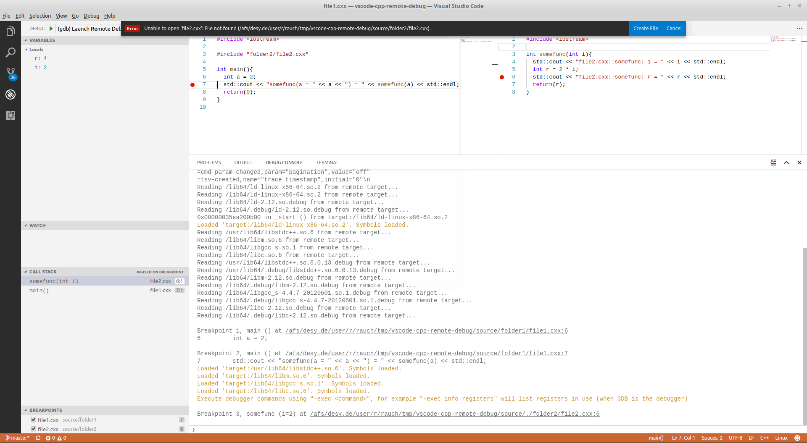

# vscode-cpp-remote-debug
Project for testing remote debugging of C++ code with gdb and gdbserver in VS Code

> **Problem**
>
> When remotely debugging C++ source code residing in a complex folder hierarchy VS Code lacks proper graphical debugging integration in the GUI.

In order to demonstrate this, this repo intentionally contains the full folder structure for out-of-source builds as well as a minimum failing folder setup consisting of two source code folders.

> **Version numbers**
>
> VS Code
> ```
> Version 1.13.1
> Commit 379d2efb5539b09112c793d3d9a413017d736f89
> Date 2017-06-14T18:18:03.540Z
> Shell 1.6.6
> Renderer 56.0.2924.87
> Node 7.4.0
> ```
>
> ms-vscode.cpptools
> ```
> Version 0.11.4: June 2, 2017
> ```

## Setup

- local machine is Linux notebook (Linux Mint 18 Cinnamon Edition), denoted by `local $`

  the file system of the remote machine is mounted on the local machine either using `File -> Connect to Server` (type: `ssh`) from the Nemo file browser or using `sshfs`
  
- remote machine is Linux server, denoted by `remote $`, on which `gdbserver` is available


## Step-by-Step Instructions to Reproduce

- SSH to remote machine and use port forwarding
  ```sh
  local $ ssh -L9091:localhost:9091 user@some.server.org
  ```
- Clone repo with
  ```sh
  remote $ git clone https://github.com/dmrauch/vscode-cpp-remote-debug.git
  ```
- Out-of-source build with debug symbols
  ```sh
  remote $ cd vscode-cpp-remote-debug/build/debug
  remote $ cmake -DCMAKE_BUILD_TYPE=Debug ../../source
  remote $ make
  ```
- Start `gdbserver`
  ```sh
  remote $ cd ../.. # going back into vscode-cpp-remote-debug/
  remote $ gdbserver :9091 build/debug/file1
  ```
- Set breakpoints somewhere in both source code files `folder1/file1.cxx` and `folder2/file2.cxx`

- Open the debug view, select the `Remote Debug` configuration and launch the debugger configuration `(gdb) Launch Remote Debugging of file1`

You should then see that VS Code can't associate the active / hit breakpoint with the open editor window (error message: `Unable to open 'file1.cxx': File not found`):



If one modifies the `cwd` property in `launch.json` to read
```json
// [...]

"cwd": "${workspaceRoot}/source/folder1",

// [...]
```
as was done for the debug configuration `(gdb) Launch Remote Debugging of file1 (cwd = folder1)` then the breakpoint in `folder1/file1.cxx` will be displayed correctly in the editor window,

but the breakpoint in `folder2/file2.cxx` will give the same error shown previously.



## Credits

- The `launch.json` is based on the following, very helpful article: [Debugging C/C++ Programs Remotely Using Visual Studio Code and gdbserver](https://medium.com/@spe_/debugging-c-c-programs-remotely-using-visual-studio-code-and-gdbserver-559d3434fb78).